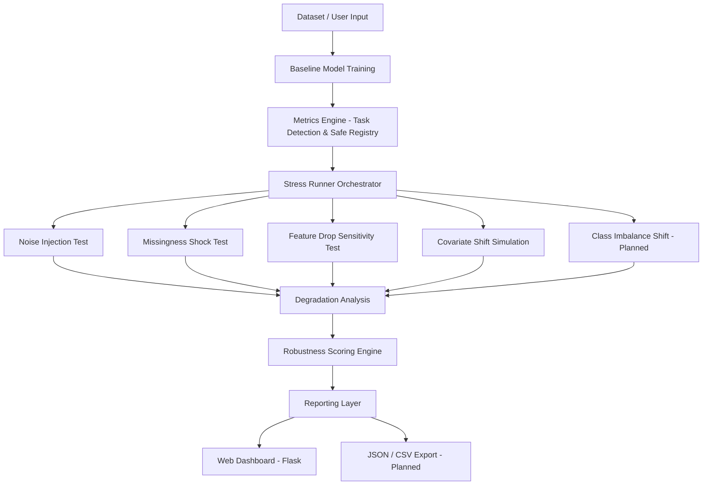

# ML-Stress-Test
## A Modular Robustness Evaluation Framework for Machine Learning Systems

Machine learning evaluation traditionally focuses on static performance metrics such as Accuracy, F1-score, RMSE, or R². However, production failures rarely arise from low baseline accuracy — they arise from instability under changing conditions.

ML-Stress-Test is a structured robustness evaluation framework that measures how models behave under controlled stress scenarios such as noise, missing data, feature dependency shifts, and distribution drift.

It shifts evaluation from:

**"How accurate is the model?"**

to:

**"How stable is the model under real-world stress?"**

---

# Problem Statement

In real-world ML systems:

- Sensors become noisy  
- Upstream pipelines introduce missing values  
- Feature contracts change  
- Data distributions drift  
- Class imbalance shifts  

Models that perform well on validation data can degrade unpredictably when these conditions change.

There is limited tooling that systematically evaluates degradation behavior across multiple stress dimensions in a modular and reproducible manner.

ML-Stress-Test addresses this gap.

---

# System Architecture

The framework is organized into modular components with clear separation of responsibilities.



### Architectural Principles

- Separation of concerns  
- Deterministic stress simulation (seed-controlled)  
- Task-aware evaluation (classification vs regression)  
- Safe metric computation wrappers  
- Modular stress test implementations  
- Extensible design for future stress modules  

---

# Web Interface

ML-Stress-Test includes a Flask-based web application that provides:

- Baseline evaluation
- Selectable stress test execution
- Degradation tables
- Stability classification summaries
- Robustness scoring overview

Core web components:

- `app.py` – Flask entry point  
- `templates/` – Structured HTML reports  
- `static/` – UI styling assets  

The web layer transforms raw degradation metrics into an interpretable evaluation dashboard suitable for experimentation and analysis.

---

# Implemented Stress Tests

## Baseline Evaluation Engine

- Automatic task detection
- Multi-metric support
- Safe metric registry
- Target NaN handling
- Structured reporting

---

## Noise Injection Stress Test

Simulates Gaussian noise scaled by feature standard deviation.

Measures:

- Absolute metric degradation
- Percentage drop
- Noise robustness summary

Purpose:
Evaluate sensitivity to feature instability and sensor noise.

---

## Feature Drop Sensitivity Test

Simulates removal of top-k important features.

Measures:

- Performance degradation after feature removal
- Feature fragility index
- Sensitivity ranking

Purpose:
Identify over-reliance on specific features and data contract risks.

---

## Missingness Shock Test

Injects controlled missing values (5%, 10%, 20%, 40%).

Measures:

- Degradation curve
- Missingness tolerance threshold
- Stability classification

Purpose:
Evaluate resilience to upstream data pipeline degradation.

---

## Covariate Shift Simulation

Simulates distribution drift using:

- Feature scaling perturbation
- Mean shifting
- Range clipping
- Category dropout
- Category substitution

Measures:

- Degradation percentage
- Shift Sensitivity Index (area-under-degradation curve)
- Stability classification (stable / moderate / fragile)

Purpose:
Evaluate robustness to distribution shift — a primary cause of production ML failure.

---

# Planned Extensions

## Class Imbalance Shift (Classification)

- Controlled imbalance alteration
- Recall degradation tracking
- Balanced accuracy monitoring
- Metric illusion detection

## Robustness Scoring Engine (improvements)

- Normalized degradation aggregation
- Early-collapse penalty
- Area-under-curve scoring
- Overall robustness index

## Reporting & Export Enhancements 

- JSON export
- CSV export
- Config-driven experiment runs
- Structured experiment metadata logging

---

# Repository Structure

```
ML-STRESS-TEST/
│
├── configs/
│   └── default.yaml
│
├── examples/
│   └── example_config.yaml
│
├── models/
│   ├── baseline.py
│   └── loader.py
│
├── stress/
│   ├── tests/
│   │   ├── noise.py
│   │   ├── missingness.py
│   │   ├── feature_drop.py
│   │   ├── covariate_shift.py
│   │   └── imbalanced_shift.py
│   │
│   ├── metrics.py
│   ├── report.py
│   ├── runner.py
│   └── schemas.py
│
├── templates/
│   ├── index.html
│   ├── report.html
│   └── error.html
│
├── static/
│   └── style.css
│
├── app.py
├── requirements.txt
└── README.md
```

---
# Running the Web Application

```bash
python app.py
```

Then open:

```
http://127.0.0.1:5000
```

---

# Why This Project Matters

Most ML repositories demonstrate:

- Model training
- Hyperparameter tuning
- Validation accuracy

Few demonstrate:

- Structured failure analysis
- Degradation modeling
- Robustness quantification
- Stability classification

ML-Stress-Test formalizes robustness evaluation as a first-class engineering process.

---

# Summary

ML-Stress-Test is a modular robustness evaluation framework designed to analyze how machine learning systems behave under stress.

It extends traditional evaluation by modeling degradation behavior and stability patterns — essential considerations for real-world ML deployment.
